# Introduction to SPsimSeq

SPsimSeq is designed to maximally retain the characteristics of a real RNA sequencing data with reasonable flexibility to simulate a wide range of scenarios. In a first step, the log-CPM outcomes from a given real data (aka source data) are used for semi-parametrically estimating gene-wise distributions. This method is based on a fast log-linear model estimation approach developed by Efron et al (1996) ^[Efron, B., & Tibshirani, R. (1996). Using specially designed exponential families for density estimation. The Annals of Statistics, 24(6), 2431-2461.]. Arbitrarily large datasets, with realistically varying library sizes, can be sampled from these estimated distributions. For scRNA-seq data, there is an additional step to explicitly account for the high abundance of zero counts. This step models the probability of zero counts as a function the mean expression of the gene and the library size of the cell (both in $\log$ scale). Zero counts are then added to the simulated data such that the observed relationship (zero probability to mean expression and library size) is maintained. Given known groups ($\ge 2$) of samples/cells in the source data, DGE is simulated by independently sampling data from distributions constructed in each group. In particular, this procedure is applied on a set of genes with fold-change in the source data more than a given threshold. Moreover, when the source dataset involves samples/cells processed in different batches, our simulation procedure incorporates this batch effect in the simulated data, if required. 

# Installing SPsimSeq

# Implementation of SPsimSeq
## Example 1: simulating bulk RNA-seq


```r
 # load the Zhang data (availabl with the package)

data("zhang.data") 
 
 # filter genes with sufficient expression (important step to avoid bugs) 
 zhang.counts <- zhang.data$counts[rowSums(zhang.data$counts > 0)>=5, ]  
 MYCN.status <- zhang.data$MYCN.status+1  
 
 # We simulate only a single data (n.sim = 1) with the following property
 # - 5000 genes ( n.genes = 5000) 
 # - 180 samples (tot.samples = 180) 
 # - the samples are equally divided into 2 groups each with 90 samples 
 #   (group.config = c(0.5, 0.5))
 # - all samples are from a single batch (batch.config = 1)
 # - we add 10% DE genes (pDE = 0.1) 
 # - we do not model the zeroes separately, they are the part of density 
 #    estimation (model.zero.prob = FALSE)
 
 sim.data.bulk <- SPsimSeq(n.sim = 1, s.data = zhang.counts, batch = NULL,
                               group = MYCN.status, n.genes = 5000, batch.config = 1,
                               group.config = c(0.5, 0.5), tot.samples = 180, pDE = 0.1,
                               model.zero.prob = FALSE, w=NULL, 
                           result.format = "list", seed = 2581988)
#> Configuring design ...
#> Preparing source data ...
#> Selecting genes ...
#> Simulating data ...
#>  ...1 of 1
                               
 sim.data.bulk1 <- sim.data.bulk[[1]]                              
 head(sim.data.bulk1$counts[, 1:5])  # count data
#>        Sample_1 Sample_2 Sample_3 Sample_4 Sample_5
#> Gene_1        0       12        4        0       53
#> Gene_2        1        0        0        0        2
#> Gene_3        1        0        1        4        2
#> Gene_4        0        0        0        0        3
#> Gene_5        0        0        0        0        0
#> Gene_6        0        1        0        1        0
 head(sim.data.bulk1$colData)        # sample info
#>          Batch Group sim.Lib.Size
#> Sample_1     1     1     20347695
#> Sample_2     1     1     32528601
#> Sample_3     1     1     21997338
#> Sample_4     1     1     20554669
#> Sample_5     1     1     33045783
#> Sample_6     1     1     27301416
 head(sim.data.bulk1$rowData)        # gene info
#>        DE.ind     source.ID
#> Gene_1      1 RP11-80F22.14
#> Gene_2      1         ADAM2
#> Gene_3      1         MS4A2
#> Gene_4      1        TMEM75
#> Gene_5      1 RP11-127B16.1
#> Gene_6      1  RP11-138A9.1
 
  

 
par(mfrow=c(1, 2))
boxplot(list(real.data=colSums(zhang.counts), 
             simulated.data=sim.data.bulk1$colData$sim.Lib.Size), 
        main="distribution of library size") 
 
zhang.counts.equi <- zhang.counts[as.character(sim.data.bulk1$rowData$source.ID), MYCN.status==2]
frac.zero.src <- rowMeans(zhang.counts.equi ==0)
frac.zero.sim <- rowMeans(sim.data.bulk1$counts==0)
plot(frac.zero.src, frac.zero.sim,  xlab="real data", 
     ylab="simulated data", main="fraction of zero counts per gene")
abline(0, 1)
```

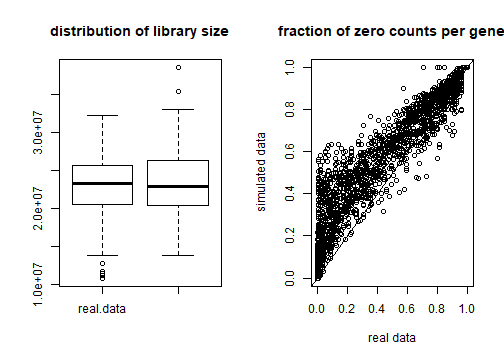

```r


par(mfrow=c(1, 2)) 
hist(rowMeans(zhang.counts.equi==0), main = "real data", 
     xlab="fraction of zero counts per gene")
hist(rowMeans(sim.data.bulk1$counts==0), main = "Simulated data",
     xlab="fraction of zero counts per gene")
```

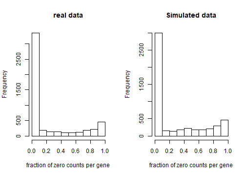

```r


par(mfrow=c(1, 2)) 
x <- log(rowMeans(zhang.counts.equi)+1)
y <- apply(zhang.counts.equi, 1, function(y) sd(y)/mean(y))
smoothScatter(x, sqrt(y), xlab="log-mean-counts", ylab="CV", main = "real data")

x <- log(rowMeans(sim.data.bulk1$counts)+1)
y <- apply(sim.data.bulk1$counts, 1, function(y) sd(y)/mean(y))
smoothScatter(x, sqrt(y), xlab="log-mean-counts", ylab="CV", main = "simulated data")
```

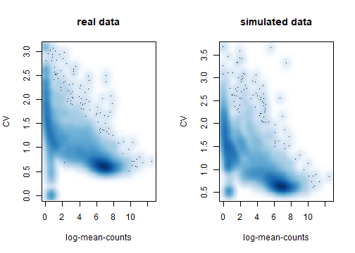

```r


par(mfrow=c(1, 2)) 
w <- log(rowMeans(zhang.counts.equi)+1)
z <- rowMeans(zhang.counts.equi==0)
smoothScatter(w, z, xlab="log-mean-counts", ylab="fraction of zeroes", main = "real data")

w <- log(rowMeans(sim.data.bulk1$counts)+1)
z <- rowMeans(sim.data.bulk1$counts==0)
smoothScatter(w, z, xlab="log-mean-counts", ylab="fraction of zeroes", main = "simulated data")
```

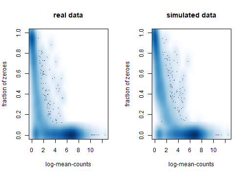

## Example 2: simulating single cell RNA-seq from a single batch (read-counts)

```r
# we simulate only a single scRNA-seq data (n.sim = 1) with the following property
 # - 5000 genes (n.genes = 5000) 
 # - 100 cells (tot.samples = 100) 
 # - the cells are equally divided into 2 groups each with 50 cells (group.config = c(0.5, 0.5))
 # - all cells are from a single batch (batch.config = 1)
 # - we add 10% DE genes (pDE = 0.1) 
 # - we model the zeroes separately (model.zero.prob = TRUE)
 # - the ouput will be in SingleCellExperiment class object (result.format = "SCE")
 
 
 library(SingleCellExperiment)
#> Loading required package: SummarizedExperiment
#> Loading required package: GenomicRanges
#> Loading required package: stats4
#> Loading required package: BiocGenerics
#> Loading required package: parallel
#> 
#> Attaching package: 'BiocGenerics'
#> The following objects are masked from 'package:parallel':
#> 
#>     clusterApply, clusterApplyLB, clusterCall, clusterEvalQ,
#>     clusterExport, clusterMap, parApply, parCapply, parLapply,
#>     parLapplyLB, parRapply, parSapply, parSapplyLB
#> The following objects are masked from 'package:SPsimSeq':
#> 
#>     sd, var
#> The following objects are masked from 'package:stats':
#> 
#>     IQR, mad, sd, var, xtabs
#> The following objects are masked from 'package:base':
#> 
#>     Filter, Find, Map, Position, Reduce, anyDuplicated, append,
#>     as.data.frame, basename, cbind, colnames, dirname, do.call,
#>     duplicated, eval, evalq, get, grep, grepl, intersect,
#>     is.unsorted, lapply, mapply, match, mget, order, paste, pmax,
#>     pmax.int, pmin, pmin.int, rank, rbind, rownames, sapply,
#>     setdiff, sort, table, tapply, union, unique, unsplit, which,
#>     which.max, which.min
#> Loading required package: S4Vectors
#> 
#> Attaching package: 'S4Vectors'
#> The following object is masked from 'package:base':
#> 
#>     expand.grid
#> Loading required package: IRanges
#> 
#> Attaching package: 'IRanges'
#> The following object is masked from 'package:grDevices':
#> 
#>     windows
#> Loading required package: GenomeInfoDb
#> Loading required package: Biobase
#> Welcome to Bioconductor
#> 
#>     Vignettes contain introductory material; view with
#>     'browseVignettes()'. To cite Bioconductor, see
#>     'citation("Biobase")', and for packages 'citation("pkgname")'.
#> Loading required package: DelayedArray
#> Loading required package: matrixStats
#> 
#> Attaching package: 'matrixStats'
#> The following objects are masked from 'package:Biobase':
#> 
#>     anyMissing, rowMedians
#> Loading required package: BiocParallel
#> 
#> Attaching package: 'DelayedArray'
#> The following objects are masked from 'package:matrixStats':
#> 
#>     colMaxs, colMins, colRanges, rowMaxs, rowMins, rowRanges
#> The following objects are masked from 'package:base':
#> 
#>     aperm, apply, rowsum
 
 # load the NGP nutlin data (availabl with the package, processed with SMARTer/C1 protocol, and contains read-counts)
data("scNGP.data")
 
 # filter genes with sufficient expression (important step to avoid bugs) 
 scNGP.data2 <- scNGP.data[rowSums(counts(scNGP.data) > 0)>=10, ]  
 treatment <- ifelse(scNGP.data2$characteristics..treatment=="nutlin",2,1) 
 
 # simulate data (we simulate here only a single data, n.sim = 1)
 sim.data.sc <- SPsimSeq(n.sim = 1, s.data = scNGP.data2, batch = NULL,
                             group = treatment, n.genes = 5000, batch.config = 1,
                             group.config = c(0.5, 0.5), tot.samples = 100, pDE = 0.1,
                             model.zero.prob = TRUE, result.format = "SCE", seed = 2581988)
#> Configuring design ...
#> Preparing source data ...
#> Fitting zero probability model ...
#> Selecting genes ...
#> Simulating data ...
#>  ...1 of 1
#> Note: The number of DE genes detected in the source data is 188 and the number of DE genes required to be included in the simulated data is 500. Therefore, candidiate DE genes are sampled with replacement.
                             
 sim.data.sc1 <- sim.data.sc[[1]]
 class(sim.data.sc1)
#> [1] "SingleCellExperiment"
#> attr(,"package")
#> [1] "SingleCellExperiment"
 head(counts(sim.data.sc1)[, 1:5])
#>        Sample_1 Sample_2 Sample_3 Sample_4 Sample_5
#> Gene_1       31        1        2        0       26
#> Gene_2       12       11      173        8        2
#> Gene_3        0       53        5        0        0
#> Gene_4        0       31        8       20        0
#> Gene_5       17       57        0       55       85
#> Gene_6        0        0        0        0       51
 colData(sim.data.sc1)
#> DataFrame with 100 rows and 3 columns
#>                Batch     Group     sim.Lib.Size
#>            <integer> <integer>        <numeric>
#> Sample_1           1         1 576970.117575162
#> Sample_2           1         1 1199418.08544437
#> Sample_3           1         1 651570.624502233
#> Sample_4           1         1 586150.651402786
#> Sample_5           1         1 1229296.11586816
#> ...              ...       ...              ...
#> Sample_96          1         2 527354.283565062
#> Sample_97          1         2 818056.688453867
#> Sample_98          1         2 625266.946364236
#> Sample_99          1         2 700384.500901245
#> Sample_100         1         2 711313.283390179
 rowData(sim.data.sc1)
#> DataFrame with 5000 rows and 2 columns
#>              DE.ind       source.ID
#>           <numeric>        <factor>
#> Gene_1            1 ENSG00000158321
#> Gene_2            1 ENSG00000101126
#> Gene_3            1 ENSG00000164306
#> Gene_4            1 ENSG00000102393
#> Gene_5            1 ENSG00000129484
#> ...             ...             ...
#> Gene_4996         0 ENSG00000184182
#> Gene_4997         0 ENSG00000283897
#> Gene_4998         0 ENSG00000141076
#> Gene_4999         0 ENSG00000116128
#> Gene_5000         0 ENSG00000119661
 
par(mfrow=c(1, 2))
boxplot(list(real.data=colSums(counts(scNGP.data2)), 
             simulated.data=colData(sim.data.sc1)$sim.Lib.Size), 
        main="distribution of library size") 
 
scNGP.data2.equi <- scNGP.data2[as.character(rowData(sim.data.sc1)$source.ID), treatment==1]
frac.zero.src <- rowMeans(counts(scNGP.data2.equi) ==0)
frac.zero.sim <- rowMeans(counts(sim.data.sc1)==0)
plot(frac.zero.src, frac.zero.sim, xlab="real data", 
     ylab="simulated data", main="fraction of zero counts per gene")
abline(0, 1)
```

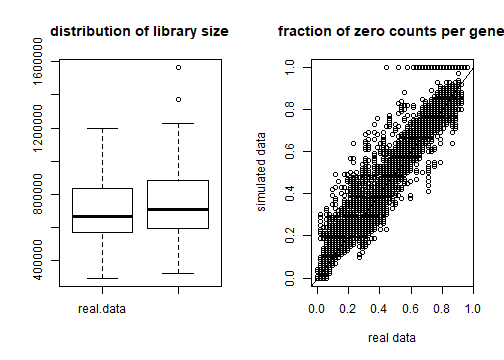

```r


par(mfrow=c(1, 2)) 
hist(rowMeans(counts(scNGP.data2.equi)==0), main = "real data", 
     xlab="fraction of zero counts per gene")
hist(rowMeans(counts(sim.data.sc1)==0), main = "Simulated data",
     xlab="fraction of zero counts per gene")
```


```r


par(mfrow=c(1, 2)) 
x <- log(rowMeans(counts(scNGP.data2.equi))+1)
y <- apply(counts(scNGP.data2.equi), 1, function(y) sd(y)/mean(y))
smoothScatter(x, y, xlab="log-mean-counts", ylab="CV", main = "real data")

x <- log(rowMeans(counts(sim.data.sc1))+1)
y <- apply(counts(sim.data.sc1), 1, function(y) sd(y)/mean(y))
smoothScatter(x, y, xlab="log-mean-counts", ylab="CV", main = "simulated data")
```

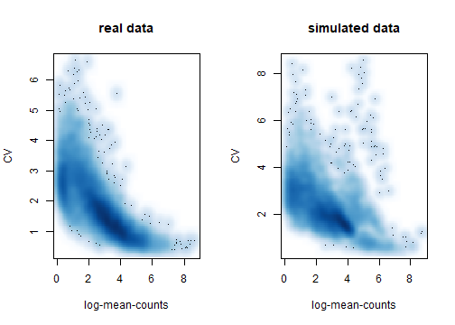

```r


par(mfrow=c(1, 2)) 
w <- log(rowMeans(counts(scNGP.data2.equi))+1)
z <- rowMeans(counts(scNGP.data2.equi)==0)
smoothScatter(w, z, xlab="log-mean-counts", ylab="fraction of zeroes", main = "real data")

w <- log(rowMeans(counts(sim.data.sc1))+1)
z <- rowMeans(counts(sim.data.sc1)==0)
smoothScatter(w, z, xlab="log-mean-counts", ylab="fraction of zeroes", main = "simulated data")
```

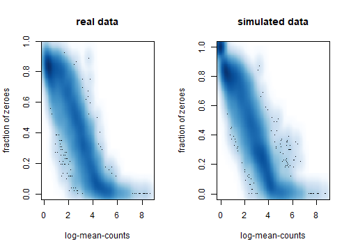

## Example 3: simulating single cell RNA-seq from a single batch (UMI counts)

```r
 # we simulate only a single scRNA-seq data (n.sim = 1) with the following property
 # - 5000 genes (n.genes = 5000) 
 # - 300 cells (tot.samples = 300) 
 # - the cells are from a single experimental group (group.config = 1)
 # - all cells are from a single batch (batch.config = 1)
 # - we add 0% DE genes (pDE = 0) 
 # - we model the zeroes separately (model.zero.prob = TRUE)
 # - since the size of the PBMC data is large, we use the subset of the cells to 
 #   fit the zero prob. model (subset.data=TRUE, n.samples=400)
 # - the ouput will be in SingleCellExperiment class object (result.format = "SCE") 
 
 library(SingleCellExperiment)
 
 # load the PBMC data (availabl with the package)
 data("PBMC.data") 
 
 # filter genes with sufficient expression (important step to avoid bugs) 
 PBMCdat2 <- PBMC.10x.data[rowSums(counts(PBMC.10x.data) > 0)>=10, ] 
 
 # simulate data (we simulate here only a single data, n.sim = 1)
 sim.data.scUMI <- SPsimSeq(n.sim = 1, s.data = PBMCdat2, batch = NULL,
                                group = NULL, n.genes = 5000, batch.config = 1,
                                group.config = 1, tot.samples = 300, pDE = 0,
                                model.zero.prob = TRUE, result.format = "SCE", const = 1,
                                subset.data=TRUE, n.samples=400, seed = 2581988)
#> Configuring design ...
#> Preparing source data ...
#> Fitting zero probability model ...
#> Selecting genes ...
#> Simulating data ...
#>  ...1 of 1
                             
 sim.data.scUMI1 <- sim.data.scUMI[[1]]
 class(sim.data.scUMI1)
#> [1] "SingleCellExperiment"
#> attr(,"package")
#> [1] "SingleCellExperiment"
 head(counts(sim.data.scUMI1)[, 1:5])
#>        Sample_1 Sample_2 Sample_3 Sample_4 Sample_5
#> Gene_1        0        0        1        0        0
#> Gene_2        0        0        0        0        0
#> Gene_3        0        0        0        0        0
#> Gene_4        0        0        0        0        0
#> Gene_5        0        0        0        0        0
#> Gene_6        0        0        0        0        0
 colData(sim.data.scUMI1)
#> DataFrame with 300 rows and 3 columns
#>                Batch     Group     sim.Lib.Size
#>            <integer> <integer>        <numeric>
#> Sample_1           1         1   1728.148182114
#> Sample_2           1         1 4932.57190769027
#> Sample_3           1         1 2057.14598741384
#> Sample_4           1         1 1767.69294622065
#> Sample_5           1         1 5109.61726482973
#> ...              ...       ...              ...
#> Sample_296         1         1 1942.04044730384
#> Sample_297         1         1 2839.75788544093
#> Sample_298         1         1  3317.7438838903
#> Sample_299         1         1 1359.41303269875
#> Sample_300         1         1 3545.24784333321
 rowData(sim.data.scUMI1)
#> DataFrame with 5000 rows and 2 columns
#>              DE.ind       source.ID
#>           <numeric>        <factor>
#> Gene_1            0 ENSG00000149091
#> Gene_2            0 ENSG00000042980
#> Gene_3            0 ENSG00000130023
#> Gene_4            0 ENSG00000100445
#> Gene_5            0 ENSG00000133111
#> ...             ...             ...
#> Gene_4996         0 ENSG00000120656
#> Gene_4997         0 ENSG00000198851
#> Gene_4998         0 ENSG00000157306
#> Gene_4999         0 ENSG00000101166
#> Gene_5000         0 ENSG00000271869
 
 
par(mfrow=c(1, 2))
boxplot(list(real.data=colSums(counts(PBMCdat2)), 
             simulated.data=colData(sim.data.scUMI1)$sim.Lib.Size), 
        main="distribution of library size") 
 
PBMCdat2.equi <- PBMCdat2[as.character(rowData(sim.data.scUMI1)$source.ID), 
                          sample(1:ncol(PBMCdat2), 300)]
frac.zero.src <- rowMeans(counts(PBMCdat2.equi) ==0)
frac.zero.sim <- rowMeans(counts(sim.data.scUMI1)==0)
plot(frac.zero.src, frac.zero.sim, xlab="real data", 
     ylab="simulated data", main="fraction of zero counts per gene")
abline(0, 1)
```

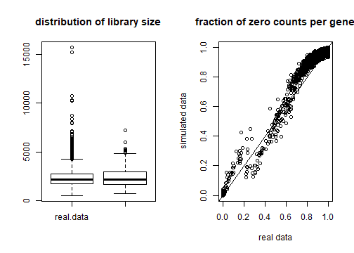

```r


par(mfrow=c(1, 2)) 
hist(rowMeans(counts(PBMCdat2.equi)==0), main = "real data", 
     xlab="fraction of zero counts per gene")
hist(rowMeans(counts(sim.data.scUMI1)==0), main = "Simulated data",
     xlab="fraction of zero counts per gene")
```

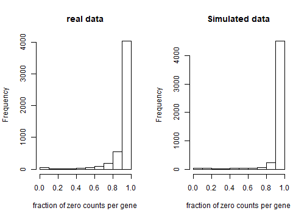

```r


par(mfrow=c(1, 2)) 
x <- log(rowMeans(counts(PBMCdat2.equi))+1)
y <- apply(counts(PBMCdat2.equi), 1, function(y) sd(y)/mean(y))
smoothScatter(x, y, xlab="log-mean-counts", ylab="CV", main = "real data")

x <- log(rowMeans(counts(sim.data.scUMI1))+1)
y <- apply(counts(sim.data.scUMI1), 1, function(y) sd(y)/mean(y))
smoothScatter(x, y, xlab="log-mean-counts", ylab="CV", main = "simulated data")
```

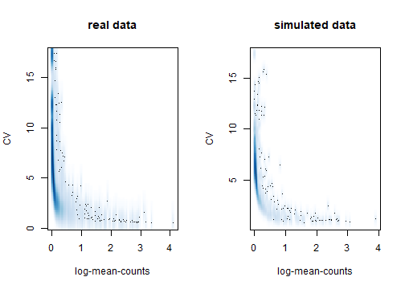

```r


par(mfrow=c(1, 2)) 
w <- log(rowMeans(counts(PBMCdat2.equi))+1)
z <- rowMeans(counts(PBMCdat2.equi)==0)
smoothScatter(w, z, xlab="log-mean-counts", ylab="fraction of zeroes", main = "real data")

w <- log(rowMeans(counts(sim.data.scUMI1))+1)
z <- rowMeans(counts(sim.data.scUMI1)==0)
smoothScatter(w, z, xlab="log-mean-counts", ylab="fraction of zeroes", main = "simulated data")
```

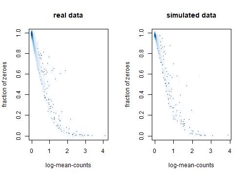

## Example 4: simulating single cell RNA-seq from a single batch (read-counts) with batch
For this example we use first simulate batch effect using parametric simulation (Splat, for ultimate flexibility) and then taking that as a source data we simulate a new single cell RNA-seq data with batch effect.


```r
# Simulate a new scRNA-seq datset using Splat simulation method  such that there are 7 batchs each with 50 cells
library(SingleCellExperiment)
library(SPsimSeq)
library(splatter)
library(scater)

params <- newSplatParams()
params <- setParams(params, update = list(batch.facLoc=0.2, batch.facScale=0.3, seed=4163))
sim.batches <- splatSimulate(params, 
                             batchCells = c(200, 200, 200, 200, 200), 
                             verbose = FALSE)

sim.batches 

#Filter genes with sufficient expression in each batch
keep <- apply(counts(sim.batches), 1, function(x){
  all(tapply(x, colData(sim.batches)$Batch, function(y) sum(y>0)>=5))
})
#table(keep) 
sim.batches2 <- sim.batches[keep,]

 # now we simulate only a single scRNA-seq data (n.sim = 1) using SPsimSeq with the following characteristics
 # - we use the above simulated data as a source data (sim.batches2)
 # - 2000 genes (n.genes = 2000) 
 # - 500 cells (tot.samples = 500), with 100 per batch 
 # - the cells are from a single experimental group (group.config = 1)
 # - cells are from 5 batchs each with equal number of cells (batch.config = rep(1/5, 5))
 # - we add 0% DE genes (pDE = 0) 
 # - we model the zeroes separately (model.zero.prob = TRUE) 
 # - the ouput will be in SingleCellExperiment class object (result.format = "SCE") 
 

 batch.factor <- as.numeric(as.factor(colData(sim.batches2)$Batch))
 SPsimuBatch <- SPsimSeq(s.data = sim.batches2, batch = batch.factor,
                             n.genes = 2000, batch.config = rep(1/5, 5), group.config=1,
                             tot.samples=500, model.zero.prob = TRUE, seed = 25081988)
 SPsimuBatch[[1]] 
 
 
 # clustering of cells
 sim.batches_norm <- normalize(sim.batches2)
 p1 <- plotPCA(sim.batches_norm, colour_by = "Batch")

 colData(SPsimuBatch[[1]])$Batch <- as.factor(paste0("Batch", colData(SPsimuBatch[[1]])$Batch)) 
 SPsimuBatch_norm <- normalize(SPsimuBatch[[1]])
 p2 <- plotPCA(SPsimuBatch_norm, colour_by = "Batch")
 
 library(gridExtra)
 grid.arrange(grobs=list(p1, p2), ncol=2, nrow=1)
```
